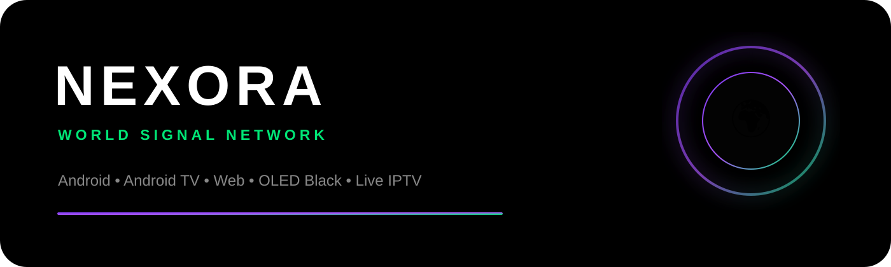
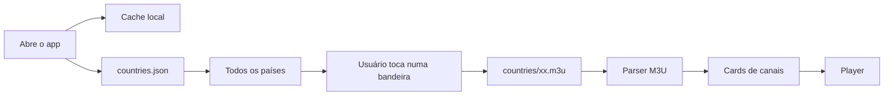
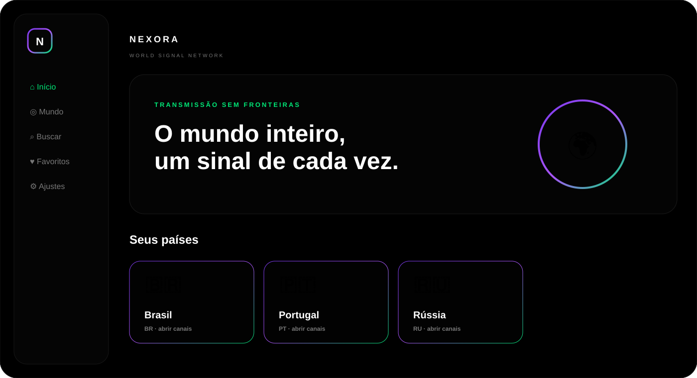

<p align="center">
  
</p>

<p align="center">
  <a href="#-comece-em-3-comandos"></a>
  <a href="#-android-tv"></a>
  <a href="#-web"></a>
  <a href="https://github.com/iptv-org/iptv"></a>
  
</p>

<h1 align="center">NEXORA TV</h1>
<p align="center"><strong>O mundo inteiro, um sinal de cada vez.</strong></p>
<p align="center">Android • Android TV • Web • sem lista fixa de países • sem chave privada</p>

---

## ✦ O que é

**Nexora TV** é uma interface universal para navegar por transmissões públicas organizadas pelo ecossistema [IPTV-org](https://github.com/iptv-org/iptv). O app busca a lista mundial de países na API oficial e carrega a playlist de cada país somente quando ela é aberta.

> **Descrição curta para GitHub**  
> TV global ao vivo por país para Android, Android TV e Web, com Expo, player HLS, cache local e catálogo dinâmico via IPTV-org.

## ⚡ Comece em 3 comandos

```bash
npm install
npm run start
npm run web
```

> Expo SDK 57 exige **Node.js 22.13.x ou superior compatível**.

<details>
<summary><strong>📱 Rodar no Android celular</strong></summary>

```bash
npm run prebuild:mobile
npm run android:mobile
```

Ou, depois do prebuild:

```bash
npx expo run:android
```
</details>

<details>
<summary><strong>📺 Rodar no Android TV</strong></summary>

1. Instale uma imagem Android TV API 31+ no Android Studio.
2. Inicie o emulador Android TV.
3. Execute:

```bash
npm run android:tv
```

No PowerShell:

```powershell
.\scripts\run-tv-local.ps1
```

O mesmo código usa `react-native-tvos`. O plugin de TV é ativado por `EXPO_TV=1` e o prebuild é sempre feito com `--clean` ao trocar entre mobile e TV.
</details>

<details>
<summary><strong>🌐 Rodar no navegador</strong></summary>

```bash
npm run web
```

Build estático:

```bash
npm run build:web
```

A pasta final é `dist/`. O projeto já inclui `netlify.toml`.
</details>

---

## 🌍 Catálogo mundial e atualização



Fontes usadas:

```text
https://iptv-org.github.io/api/countries.json
https://iptv-org.github.io/api/categories.json
https://iptv-org.github.io/iptv/countries/{codigo}.m3u
```

O catálogo de países é carregado do cache imediatamente e atualizado em segundo plano **a cada abertura do app**. A playlist de um país segue o mesmo modelo: cache primeiro, rede logo depois.

## 🎨 Design system

| Elemento | Regra |
|---|---|
| Fundo | `#000000` OLED absoluto |
| Superfícies | `#050505` / `#0D0D0D` |
| Borda | gradiente `#7C3AED → #A855F7 → #00E676` |
| Loading | RGB animado |
| Foco TV | escala + borda neon |
| Navegação | bottom bar no mobile; sidebar em TV/desktop |
| Player | moldura neon + preto absoluto |

<p align="center">
  
</p>

## 📺 Android TV

O projeto usa a estratégia oficial do Expo para TV:

- `react-native` aponta para `react-native-tvos@0.86-stable`;
- `@react-native-tvos/config-tv` prepara o projeto nativo;
- `EXPO_TV=1` ativa launcher/banner de TV;
- cards são `focusable` e possuem estado visual para D-pad;
- a UI troca automaticamente para sidebar em TV.

### APK de Android TV

```bash
npm run build:apk:tv
```

ou:

```powershell
.\scripts\build-tv-apk.ps1
```

## 📱 APK Android

```bash
npm run build:apk:mobile
```

ou:

```powershell
.\scripts\build-mobile-apk.ps1
```

Os perfis `preview-*` do `eas.json` geram **APK instalável**. Os perfis `production-*` geram **AAB** para loja.

### Primeiro build com EAS

Na primeira vez, vincule o projeto à sua conta Expo/EAS:

```bash
npx eas login
npx eas build:configure
```

Depois use normalmente `npm run build:apk:mobile` ou `npm run build:apk:tv`. O `projectId` criado pelo EAS ficará associado ao seu projeto/conta.

## 🌐 Web

O player web usa **hls.js** para streams `.m3u8` em navegadores com Media Source Extensions. Streams progressivos são enviados diretamente ao elemento `<video>`.

> Alguns links podem funcionar no Android e falhar na Web por **CORS**, `Referer`, `User-Agent`, geobloqueio ou regras do provedor. Isso é uma limitação do navegador/fonte, não do catálogo.

## 🧠 Funcionalidades da v1.0.0

- [x] Todos os países retornados pelo IPTV-org
- [x] Bandeiras e códigos ISO
- [x] Playlist por país sob demanda
- [x] Busca de país
- [x] Busca dentro da playlist do país
- [x] Categorias vindas de `group-title`
- [x] Logos vindos do M3U quando disponíveis
- [x] Favoritos locais
- [x] Continuar assistindo / histórico local
- [x] Países fixados
- [x] Atualização manual + atualização em segundo plano
- [x] Player HLS Android
- [x] Headers `Referer` e `User-Agent` no player nativo quando presentes
- [x] Picture-in-Picture nativo
- [x] Android TV / D-pad
- [x] Web com HLS.js
- [x] Netlify pronto
- [x] Tema OLED + RGB loaders

## 🗂 Estrutura

```text
nexora-tv/
├─ app/
│  ├─ index.tsx
│  ├─ explore.tsx
│  ├─ search.tsx
│  ├─ favorites.tsx
│  ├─ settings.tsx
│  ├─ country/[code].tsx
│  └─ player/[id].tsx
├─ src/
│  ├─ components/
│  ├─ hooks/
│  ├─ services/
│  ├─ state/
│  ├─ theme/
│  └─ types/
├─ assets/
├─ scripts/
├─ eas.json
├─ app.config.ts
└─ netlify.toml
```

## 🔐 Segurança e privacidade

- nenhuma API key privada é embutida;
- favoritos/histórico ficam no armazenamento local;
- não há conta de usuário nem backend obrigatório;
- nenhuma transmissão é hospedada pelo Nexora TV;
- `usesCleartextTraffic` está habilitado no Android porque parte das playlists públicas utiliza HTTP. Se você quiser aceitar somente HTTPS, desative essa opção em `app.config.ts`.

## ⚖️ Aviso sobre conteúdo

Este projeto funciona como **agregador/player**. Os links e metadados vêm do IPTV-org e das fontes de transmissão indicadas por ele. Disponibilidade, região, direitos, estabilidade e conteúdo pertencem às respectivas emissoras/provedores. Revise as regras aplicáveis antes de publicar o aplicativo em uma loja.

## 🧪 Validação

```bash
npm run typecheck
npm run build:web
```

O GitHub Actions em `.github/workflows/ci.yml` executa essas duas etapas em pushes e pull requests.

## 🧭 Roadmap

- [ ] EPG/programação por país usando fontes do ecossistema IPTV-org
- [ ] teste de saúde de stream antes de abrir
- [ ] fallback entre múltiplas URLs do mesmo canal
- [ ] busca global de canais com índice local opcional
- [ ] QR para enviar canal do celular para TV
- [ ] PWA instalável aprimorada
- [ ] sincronização opcional entre dispositivos

---

<p align="center">
  <strong>NEXORA TV</strong><br/>
  <sub>OLED BLACK • GLOBAL SIGNAL • MOBILE + TV + WEB</sub>
</p>
